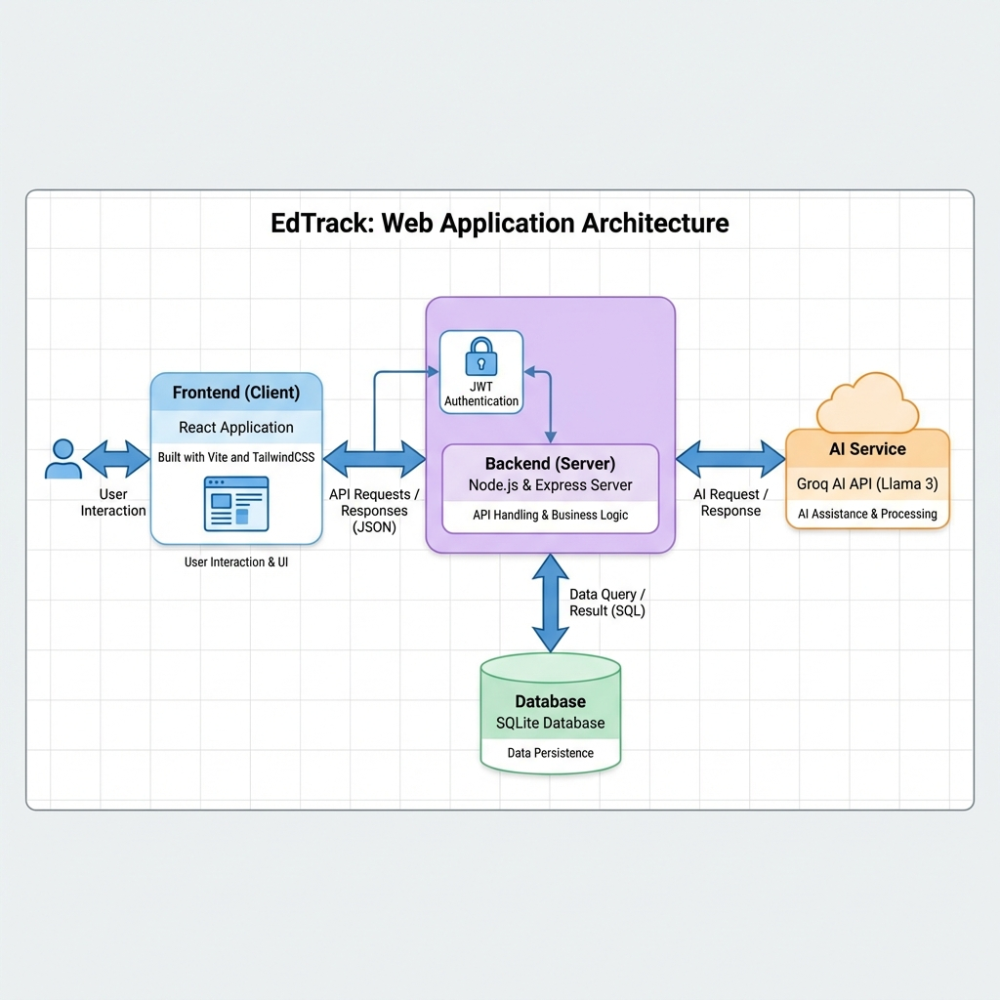

# EdTrack / College Hackathon Attendance

A comprehensive web application for managing college attendance and digital campus features, built for a hackathon. The system features a modern React frontend and a robust Node.js backend with AI integration.

## Features

- **User Authentication**: Secure login and registration for students and administrators using JWT.
- **Dashboard**: Interactive dashboards for tracking attendance and performance metrics.
- **QR Code Attendance**: Scan QR codes to mark attendance efficiently.
- **AI Assistant**: Integrated AI chat (powered by Groq Llama 3) to assist students with queries.
- **Classroom Management**: Digital tools for managing classes and subjects.
- **File Uploads**: Support for submitting assignments and documents.

## Architecture



## Tech Stack

### Client (Frontend)
- **Framework**: React (v19) with Vite
- **Styling**: TailwindCSS
- **Routing**: React Router DOM
- **Icons**: Lucide React
- **QR Scanning**: html5-qrcode, react-qr-code

### Server (Backend)
- **Runtime**: Node.js
- **Framework**: Express.js
- **Database**: SQLite (via Sequelize)
- **Authentication**: JSON Web Token (JWT) + Bcrypt
- **AI**: Groq SDK
- **File Handling**: Multer

## Application Visuals

### Dashboard
<!-- Insert dashboard screenshot here -->
> *Dashboard visualization (user to add)*

### Login Screen
<!-- Insert login screenshot here -->
> *Login screen visualization (user to add)*

## Getting Started

### Prerequisites

- Node.js (v18 or higher) installed

### Installation

1.  **Clone the repository:**
    ```bash
    git clone https://github.com/thatrasunil/college-hackathon-Attendence.git
    cd college-hackathon-Attendence
    ```

2.  **Setup Backend:**
    ```bash
    cd server
    npm install
    ```
    Create a `.env` file in the `server` directory with:
    ```env
    PORT=5000
    JWT_SECRET=your_jwt_secret
    GROQ_API_KEY=your_groq_api_key
    ```
    *Note: The application uses a local SQLite database, so no external database configuration is required.*

3.  **Setup Frontend:**
    ```bash
    cd ../client
    npm install
    ```

### Running the Application

1.  **Start the Backend Server:**
    ```bash
    # In the server directory
    npm start
    ```
    The server will run on `http://localhost:5000`.

2.  **Start the Frontend Development Server:**
    ```bash
    # In the client directory
    npm run dev
    ```
    The application will activate on `http://localhost:5173` (or the port shown in terminal).

## Usage

- Navigate to the frontend URL.
- Register a new account or log in with demo credentials (see `server/seed_sqlite.js`).
- Explore the dashboard, try the AI chat, or test the attendance features.
